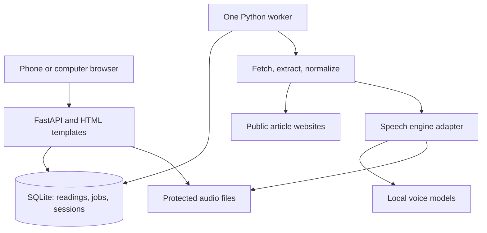

# Article Reader: architecture and implementation specification

Version 2 · 9 September 2026 · Intended handoff for Codex, Claude, or a human developer.

This document is the implementation brief. It consolidates the owner's decisions and supplies explicit defaults for the remaining engineering choices. The application has not been built or benchmarked. Commands, interfaces, schemas, and limits below are contracts to implement, not claims about existing software.

## 1. Product and acceptance boundary

Build a free app for a small group that accepts a news article or blog URL, extracts the full useful article, and reads it aloud naturally in its original language. Support Serbian, English, and German on a computer or phone, with the page open.

| Requirement | Decision |
| --- | --- |
| Input | Public news articles and blog posts; manual text paste as an extraction fallback |
| Content | Complete article body with page clutter removed; preserve meaning and order |
| Languages | Serbian, English, German |
| Serbian input | Support Latin and Cyrillic scripts; proposed default consistent with Serbian support |
| Speech quality | Natural enough for comfortable long-article listening; fluency alone is insufficient |
| Devices | Desktop/laptop browsers and phone browsers, foreground playback |
| Hardware | PC A: 32 GB RAM. PC B: Dell laptop, 16 GB RAM |
| Daily use | Run the app on whichever PC the owner is using |
| Cost | Free for listeners; local prototype targets no new recurring service charge |
| Budget later | Decide after actual quality, CPU, memory, and usage measurements |
| Core language | Python; a small JavaScript browser player is expected |

Treat the 16 GB laptop as the baseline. CPU architecture, processor models, operating systems, and GPU availability are unknown. Do not infer Windows from the word PC, or assume a GPU. Provide a CPU path and record the real environments during implementation. More RAM on PC A does not establish that it can generate speech faster.

Default features: language detection with manual override, extracted-text preview, play/pause, speed adjustment, navigation between prepared sections, same-browser resume, recent reading history, cancellation, retry, and portable reading-list/progress export.

Later scope: screen-off guarantees, background playback, offline audio downloads, translation, summarization, PDFs, subscriber login, automated paywall access, browser extensions, native mobile apps, public signup, cloud synchronization, voice cloning, and training a new voice. A developer may document these extensions without implementing them. ntfy is inspiration for a simple free service; it is not required in the architecture. Free access and an open-source release are separate decisions; the project's release license is not yet selected.

**Release rule:** the three-language MVP is complete only when a fluent listener accepts a suitable voice in each language, including Serbian in both scripts, and the functional acceptance tests pass. An experimental Serbian candidate or a robotic substitute does not satisfy the quality requirement.

## 2. Running on two PCs

Use two equivalent, independent installations of the same application version.

| Item | PC A: 32 GB | PC B: 16 GB Dell |
| --- | --- | --- |
| Code and dependency lock | Same Git revision and lockfile | Same Git revision and lockfile |
| Python environment | Created on this machine | Created on this machine |
| Database and sessions | Local to PC A | Local to PC B |
| Audio cache | Local to PC A | Local to PC B |
| Voices | Same approved, checksummed model releases | Same approved, checksummed model releases |
| Default worker count | 1 | 1 |
| Default resident voice count | 1; optionally increase after measurement | 1 |
| Default CPU inference threads | 2, clamped to available CPUs | 2, clamped to available CPUs |

The owner starts the installation on the current machine. It serves that machine's browser and, in explicit LAN mode, phones on the same trusted Wi-Fi network. The application prints the current host URL. A phone must use the active PC's address; `localhost` on the phone refers to the phone itself. Guest Wi-Fi isolation, firewall rules, changing DHCP addresses, VPN routing, and a sleeping host can prevent access. Document these checks without opening router ports or exposing the service automatically.

Both installations may run at once as separate instances. Neither delegates work to the other. Assign a persistent random `instance_id` to each installation and display an editable machine label. Include `instance_id` in browser storage keys and API metadata so an old browser state cannot attach to a replacement database or another server accidentally.

Automatic history and progress synchronization is not assumed. Provide manual export/import as described in section 13. Switching PCs means switching instances and optionally importing a reading bundle. A phone and a desktop also have separate browser identities unless the user imports their reading data.

Keep live runtime data outside Git and outside cloud-synced/network folders. Do not synchronize an active SQLite database with OneDrive, Dropbox, a network share, or Git. SQLite's [WAL documentation](https://www.sqlite.org/wal.html) requires participating processes to be on the same host. Recreate virtual environments on each PC; do not copy them between operating systems. Model files can be copied after checksum verification; secrets and machine-specific paths should not be copied.

## 3. Architecture and process ownership

Use one small Python service, one worker process, and local storage.



The API authenticates access, validates inputs, enqueues work, reports state, stores progress, and serves finished audio sections. The worker performs network retrieval, extraction, language preparation, and synthesis. SQLite holds the durable queue; it is the source of truth for jobs and manifests. Audio files contain bytes, not authoritative job state.

| Layer | Recommended choice | Boundary |
| --- | --- | --- |
| Runtime | Python 3.12 initial target, subject to real OS/wheel compatibility | Pin the tested version in the project |
| Dependency management | `uv`, `pyproject.toml`, committed `uv.lock` | Reproducible installation on each machine |
| API/server | FastAPI and Uvicorn | One API process in normal local operation |
| UI | Jinja2, semantic HTML/CSS, small JavaScript modules | Responsive page; no frontend build framework required |
| Safe downloader | HTTPX with a tested address-pinning transport or equivalent | All article network access passes through this boundary |
| Article extraction | Trafilatura behind an adapter | Never allow it to perform an unvalidated second download |
| Language detection | Small local detector behind an adapter | Verify en/de/sr coverage; retain manual override |
| Speech | Piper is the first engine candidate | Select voices only after the quality evaluation |
| Database | Standard-library SQLite, versioned SQL migrations | Short transactions; per-process connections |
| Audio | Completed PCM WAV sections to start | Authenticated binary delivery and range support |
| Verification | pytest; browser tests where useful; real-device listening | Mock synthesis for ordinary application tests |

FastAPI supports [Jinja2 templates](https://fastapi.tiangolo.com/advanced/templates/). Its [background task guidance](https://fastapi.tiangolo.com/tutorial/background-tasks/) distinguishes lightweight tasks from heavy computation. A response background callback is not the durable speech queue. Keep model loading out of module import and out of API startup.

Implement a launcher that supervises API and worker, handles shutdown, and refuses a duplicate worker for the same data directory. Use a cross-platform process strategy; do not assume `fork`. Python documents [spawn/import constraints](https://docs.python.org/3/library/multiprocessing.html). Guard entry points, avoid import-time process creation, and prevent development auto-reload from spawning extra workers. CPU/model work must not occupy the API event loop.

## 4. Repository and configuration contracts

The following paths are proposed repository contents, not files supplied with this brief.

| Path | Responsibility |
| --- | --- |
| `src/article_reader/cli.py` | Launch, doctor, setup, export/backup administration |
| `config.py` | Typed settings, precedence, validation, platform data paths |
| `api/` | Routes, request/response models, access checks, error mapping |
| `db/` and `db/migrations/` | Schema, transactions, job claiming, migrations |
| `fetch/` | URL parsing, DNS/address policy, pinned connections, bounded retrieval |
| `extract/` | Trafilatura adapter, block representation, extraction diagnostics |
| `text/` | Language selection, script handling, normalization, segmentation |
| `speech/` | Engine protocol, model registry, Piper adapter, evaluation tooling |
| `worker/` | Queue loop, leases, cancellation, recovery, atomic publication |
| `storage/` | Audio paths, integrity checks, cache cleanup, portable bundles |
| `web/templates/`, `web/static/` | Reader page, styles, player and state modules |
| `tests/fixtures/` | Synthetic HTML/text fixtures and declared expected content |
| `docs/` | Setup, voice evaluations, design decisions, current implementation status |
| `config.example.toml` | Documented safe local defaults |

Default runtime paths should use the platform's application-data directory through `pathlib`/a platform path helper. Support an explicit `data_dir`. Models, audio, temporary files, SQLite, and secrets live there. Support spaces, non-ASCII usernames, Cyrillic filenames, and Windows path rules. Audio filenames use generated IDs, never article titles or URL paths.

Proposed defaults, adjustable after benchmarking:

```toml
[server]
bind = "127.0.0.1"
port = 8765
lan_mode = false

[worker]
processes = 1
tts_threads = 2
resident_models = 1
max_waiting_chains = 10
max_unfinished_request_chains_per_viewer = 1
heartbeat_seconds = 5
lease_seconds = 120
max_automatic_recoveries = 1

[fetch]
connect_timeout_seconds = 5
overall_timeout_seconds = 25
max_redirects = 5
max_decoded_bytes = 5242880
max_article_characters = 100000
max_url_characters = 4096

[speech]
max_chunk_characters = 600
chunk_timeout_seconds = 120

[cache]
max_audio_bytes = 2147483648
inactive_days = 7
playback_lease_seconds = 180
min_free_disk_bytes = 1073741824

[history]
max_saved_readings_per_viewer = 200
```

Config precedence: checked-in defaults, local config file, explicit CLI options. Environment variables may be supported with an `ARTICLE_READER_` prefix. Bound and validate every numeric setting. Treat limits as limits: report oversized articles instead of silently truncating them. A soft application-memory target of 4 GiB on the laptop is a benchmark goal, not a measured result or an automatic reason to choose a worse voice.

Target CLI to implement:

```text
uv sync --locked
uv run --locked article-reader doctor
uv run --locked article-reader voices list
uv run --locked article-reader voices install <approved-voice-id>
uv run --locked article-reader voices install --for-evaluation <candidate-voice-id>
uv run --locked article-reader evaluate-voices
uv run --locked article-reader serve
uv run --locked article-reader serve --lan
```

`doctor` reports OS/architecture, Python and SQLite versions, logical CPU count, RAM if detectable, free disk, model availability, audio directory access, and port conflicts. It does not upload diagnostics. Evaluation-only installation does not approve a voice for automatic use. Create a lockfile during initial development, then use locked installs as documented by [uv](https://docs.astral.sh/uv/concepts/projects/sync/). Provide PowerShell and POSIX setup instructions for tested platforms; label untested platforms honestly. Docker is optional later.

## 5. Voice selection and engine boundary

Quality evaluation precedes committing to an engine or buying hosting. Nothing in this brief certifies the naturalness or speed of a downloaded model.

| Language | First evaluation path | Required evidence |
| --- | --- | --- |
| English | An appropriate Piper English voice | Fluent-listener acceptance and local measurements |
| German | An appropriate Piper German voice | Fluent-listener acceptance and local measurements |
| Serbian | Community Serbian candidate, with alternatives if needed | Verified Serbian language, Latin/Cyrillic handling, sustained listening comfort |

Piper's [voice catalogue](https://github.com/OHF-Voice/piper1-gpl/blob/main/docs/VOICES.md) lists English and German options. The standard `sr_RS-serbski_institut-medium` [model card](https://huggingface.co/rhasspy/piper-voices/blob/main/sr/sr_RS/serbski_institut/medium/MODEL_CARD) points to a dataset published as [Lower Sorbian](https://github.com/marytts/serbski-institut-dsb-data). Do not accept that catalogue entry as verified Serbian support.

The [community Serbian model](https://huggingface.co/phantom9623/piper-serbian-tts) provides an [ONNX export](https://huggingface.co/phantom9623/piper-serbian-tts/tree/main) named `sr_Marko_medium.onnx`. Its author notes prosody limitations, and its [model card](https://huggingface.co/phantom9623/piper-serbian-tts/blob/main/MODEL_CARD) has inconsistent language metadata. Its runtime [configuration](https://huggingface.co/phantom9623/piper-serbian-tts/blob/main/sr_Marko_medium.onnx.json) selects `sr`. This is a candidate to inspect and hear, not a pre-approved default.

Use a model registry with stable voice ID, language/script support, source URL and revision, SHA-256 for model/config files, engine version, model/data license references, sample rate, evaluation status, and evaluation notes. Record exact revisions at implementation time; do not invent checksums. Pin supported engine packages and models independently. Check individual model documentation and provenance; a repository-wide license badge alone does not settle every voice's terms. Select the application release license with its actual dependencies in mind.

Download models in an explicit setup step, with progress and checksum verification. Load the exported inference format; training checkpoints and remote executable code are unnecessary for the MVP. Keep experimental voices visibly experimental and outside automatic selection. An unavailable approved voice produces `VOICE_UNAVAILABLE`, not a silent substitution. Do not replace local synthesis with an unofficial remote speech service merely to make a demo pass.

Proposed interface:

```python
class SpeechEngine(Protocol):
    def load(self, voice: VoiceSpec) -> None: ...
    def synthesize(self, text: str, settings: SpeechSettings) -> AudioResult: ...
    def close(self) -> None: ...
```

`AudioResult` carries PCM samples or a controlled temporary output, sample rate, sample width, channels, and duration. It cannot supply an arbitrary final filesystem path. The worker owns publication. Piper's [Python API](https://github.com/OHF-Voice/piper1-gpl/blob/main/docs/API_PYTHON.md) supports WAV synthesis and audio chunks. Keep engine-specific phoneme/token limits inside the adapter.

The evaluation set includes short passages and a continuous approximately ten-minute article per language. For Serbian, include equivalent Latin and Cyrillic text, `č ć ž š đ`, `љ њ ђ ћ џ`, names, loanwords, numbers, dates, quotations, and abbreviations. Evaluate German umlauts/ß, compound words, decimal commas, and dates; include equivalent English cases. A fluent listener must find the voice comfortable and free of recurring distracting errors, missing words, repetition, or unintended language switching.

Record cold/warm load time, generation time, output duration, time to first audio, memory, and CPU use on both machines. Record real-time factor as generation seconds divided by audio seconds. At playback speed `s`, sustained streaming needs average real-time factor below `1/s`, plus a practical buffer. This is a capacity check, not a promise about either PC. If local Serbian quality fails, document the failure and evaluate another suitable model; discuss the actual cost/quality tradeoff before adding a paid provider. Extraction and UI work can continue while voice selection remains unresolved.

## 6. Article retrieval and extraction

All network access for submitted articles goes through the safe downloader. Pass downloaded HTML bytes/text into the extraction adapter. Do not call an extraction helper that downloads the URL again and bypasses this policy.

The downloader accepts HTTP/HTTPS on ports 80/443 initially. Remove fragments for fetching while preserving the submitted URL. Reject user-info credentials, malformed hosts, unsupported schemes, loopback/private/link-local/multicast/reserved addresses, and ambiguous numeric IP forms. Resolve both IPv4 and IPv6 and reject non-public destinations. Bind the connection to a validated address while preserving the original hostname for TLS certificate verification and SNI; validating DNS and then independently resolving again is insufficient. Apply the same policy at every manual redirect. Keep environment proxies and browser/session cookies out of these requests. These controls address the URL-fetching boundary described in [OWASP's SSRF guidance](https://cheatsheetseries.owasp.org/cheatsheets/Server_Side_Request_Forgery_Prevention_Cheat_Sheet.html).

Set a truthful application user agent. Respect site access restrictions and normal rate limits. Do not solve CAPTCHAs or bypass logins/paywalls. Bound the whole operation, redirects, compressed and decompressed data, and parser work. Reject unsupported document types, downloads, oversized responses, and repeated redirects. Check actual content as well as headers; a status-200 CAPTCHA or cookie page is not an article. Treat 401/403/429 and server failures distinctly. Respect a bounded `Retry-After` when retrying; no endless retry loops.

Initially support ordinary HTML article pages. JavaScript-only sites receive a clear failure and manual-paste option. Headless browsing is deferred; if introduced later it needs the same destination policy for all subrequests. Do not follow canonical, AMP, image, iframe, or related-story links automatically. Preserve query parameters that may select content; do not strip everything after `?`. Keep original and final URLs, and treat publisher-provided canonical URLs as metadata.

Use Trafilatura with comments excluded and structure retained; its [documentation](https://trafilatura.readthedocs.io/en/latest/usage-python.html) describes these controls. Disable external XML entities and resource loading in any parser involved. Preserve headings, paragraphs, lists, quotations, and meaningful content in source order. Avoid duplicating the title, repeated mobile/desktop article copies, share buttons, recommendations, cookie notices, and author biography widgets. Detecting all of these perfectly is not guaranteed; build representative fixtures and expose the extracted preview.

Represent content as ordered blocks: `heading`, `paragraph`, `list_item`, `quote`, `table`, or `code`. Each block has an ordinal, text, and stable text hash. Preserve display text separately from speech text. For simple tables, speak headers with row values; if a complex table/code block cannot be read faithfully, mark the article `needs_review`, show the affected content, and let the user explicitly choose what to read. Do not silently omit substantial content and label it a full article.

Use extraction diagnostics such as title presence, meaningful text length, link density, obvious restriction-page phrases, and retained block count. Short text alone is not proof of failure. Route questionable results to review; do not claim a numeric confidence score is calibrated unless it has been evaluated. A source that returns only a teaser must not be treated as verified full content. The manual-paste path shares the text/language/speech pipeline and limits.

## 7. Language, normalization, and segmentation

Use HTML language metadata as a hint and compare it with a locally detected language from sufficient article text. Automatic choices are limited to approved Serbian, English, or German voices. If hints disagree, text is too short, or the detector cannot reliably distinguish Serbian from Croatian/Bosnian/related languages, enter `awaiting_input` and show a language selector. Do not silently select Croatian or Slovenian as Serbian. Store the detection source and manual override.

Default to one article language and one voice. Embedded names and foreign quotations remain intact. Multi-voice code-switching and translation are later work. Keep Serbian Cyrillic as Cyrillic unless the evaluated engine needs transliteration. If conversion is required, apply it only to speech text, preserve the original, and test digraphs, capitalization, foreign words, and mixed-script passages.

Normalize Unicode conservatively, preferably NFC; retain diacritics, mathematical symbols, apostrophes, decimal separators, and meaningful punctuation. Decode entities and normalize whitespace without joining unrelated paragraphs. Repair obvious line-wrap artifacts only with tested rules. Do not globally remove hyphens, parentheses, numbers, URLs, or bracketed content: they can contain article meaning. Make abbreviation/number handling language-aware and independently testable. Examples include `Dr.`, `z. B.`, Serbian `dr.`/`prof.`/`god.`, German `1.234,56`, and Serbian date formats.

Segment at sentence/paragraph boundaries using language-aware rules. Avoid splitting after every period or at arbitrary byte offsets. Keep each speech chunk below the configured character limit and the engine's actual input limits. For an unusually long sentence, split at a safe clause/whitespace boundary and retain its complete content. Never drop overflow text.

Save a mapping from each speech chunk to source block ordinals and character spans. Version the normalizer and segmenter. Deterministic segmentation and documented speech-only transformations make missing-text checks, resume, cache invalidation, and later voice changes tractable. Inline webpage instructions are article data; no fetched text becomes an application command, model configuration, or agent instruction.

## 8. Data model and invariants

Use UUIDs for public object IDs and UTC timestamps. The following is a logical schema; implement versioned migrations and constraints rather than copying it into an unreviewed ORM model.

| Entity | Essential fields and rules |
| --- | --- |
| `instance` | Persistent `instance_id`, label, schema version, creation time |
| `viewers` / `sessions` | Browser identity; hashed opaque session token, expiry, revocation; no token in URLs |
| `readings` | Owner/viewer ID, submitted URL or manual-input label, article ID, active rendition ID, created/last-opened time |
| `articles` | Immutable extracted snapshot: owner, original/final URL, title, ordered blocks, text hash, metadata, detection hints, extraction version and review flags |
| `renditions` | Article ID, language, voice ID, model/config digests, normalization/segmenter versions, synthesis settings, portable contract hash, owner-scoped cache key, state, manifest revision, total chunk count |
| `audio_chunks` | Rendition ID + unique ordinal, source spans, speech-text hash, state, relative file path, file digest, format, duration, byte count, publication generation |
| `jobs` | Reading/rendition ID, kind (`prepare` or `synthesize`), state, stage, timestamps, owner lease/token, recovery count, cancellation flag, structured error |
| `idempotency_keys` | Viewer + operation + client key, normalized request hash, created resource/response, expiry |
| `progress` | Viewer + reading, rendition ID, chunk/offset, source-block anchor, revision, updated time |
| `playback_leases` | Viewer, rendition ID, expiry; at most one actively protected rendition per viewer |

A reading is the user's saved item. An article is an immutable content snapshot. A rendition is one specific audio interpretation of that snapshot. A job prepares an article or renders a rendition. Changing voice or refreshing a source creates a new rendition or snapshot; it does not mutate audio beneath the current player.

Scope deduplication to one viewer in v1. Authorization always follows reading/article ownership; random IDs and cache hashes are not authorization. Cross-user cache deduplication is deferred. Enforce uniqueness for chunk ordinals, active synthesis per rendition, and cache keys within the owner scope. One unfinished request chain per viewer prevents accidental floods; multiple completed readings remain playable.

A `prepare` job fetches/extracts the snapshot. If a language and an evaluated voice can be selected, its completion transaction enqueues a `synthesize` job. If review or language selection is required, it waits for input. The explicit render request resolves that wait and enqueues synthesis atomically. A reserved request-chain slot spans this transition: internal continuation must not fail merely because other users filled the admission queue.

Use foreign keys, WAL on a local disk, a busy timeout, and short bounded transactions. Each process/thread gets its own appropriate connection. Avoid database transactions during downloading or synthesis. Use an atomic claim with a conditional update/transaction; two claimers must never both believe they own a job. Record `sqlite3.sqlite_version` in diagnostics and test the actual runtime. On schema upgrades, make a consistent backup, apply migrations atomically where supported, and refuse incompatible newer schema versions instead of resetting user data.

## 9. API contracts

All JSON endpoints live under `/api`. Return typed JSON and stable machine-readable error codes. Use same-origin browser requests; do not enable wildcard CORS. Protected routes require a valid browser session and ownership checks. Opaque IDs below are illustrative.

| Method and route | Contract |
| --- | --- |
| `GET /api/meta` | Instance ID/label, app version, capability summary; no secrets or local paths |
| `POST /api/session/start` | Establish a browser identity; LAN mode additionally validates its access code |
| `DELETE /api/session` | Revoke this session; explain that an exported bundle is the portability mechanism |
| `GET /api/voices` | Installed/available voice IDs, languages/scripts, evaluation status; no automatic downloads |
| `POST /api/readings` | Accept a URL; reserve capacity and enqueue preparation; return 202 |
| `POST /api/readings/text` | Accept bounded manual text/title/language; use the same downstream pipeline |
| `GET /api/readings` | Paginated history for this viewer only |
| `GET /api/readings/{id}` | Article preview/review flags, language choice, active jobs, rendition summaries |
| `POST /api/readings/{id}/renditions` | Choose language/voice or rerender an existing snapshot; reuse a matching ready rendition where valid |
| `GET /api/jobs/{id}` | State, current stage, completed work, cancellation/retry information |
| `POST /api/jobs/{id}/cancel` | Idempotently request cancellation; report actual terminal/current state |
| `POST /api/jobs/{id}/retry` | Create a new job attempt linked to the old job, reusing only verified compatible work |
| `GET /api/renditions/{id}/manifest` | Ordered chunk metadata, ready prefix, exact known durations, completion state, revision/ETag |
| `GET/HEAD /api/audio/{chunk_id}/{digest}.wav` | Authorized immutable audio bytes; range requests and correct content type |
| `PUT /api/readings/{id}/progress` | Save position with expected revision; renew short playback protection when active |
| `DELETE /api/readings/{id}` | Cancel its work and delete owner references; collect unreferenced audio safely |
| `POST /api/exports` | Export selected owned reading records to the portable JSON format |
| `POST /api/imports` | Validate a bounded portable JSON bundle and import under the current viewer |

Mutating requests that create work require `Idempotency-Key`. Bind it to viewer, operation, and canonical validated payload. Same key/same payload returns the original resource; same key/different payload returns 409. Keep keys for at least 24 hours. Two rapid clicks or a client retry after a lost response must not generate two copies. Idempotency reuse does not bypass authorization or imply that an old source URL has fresh content.

Example submission:

```json
{
  "url": "https://publisher.example/article",
  "language": "auto",
  "voice_id": null
}
```

```json
{
  "reading_id": "reading-uuid",
  "job_id": "prepare-job-uuid",
  "state": "queued"
}
```

A new URL submission fetches the source through the downloader. Deduplicate audio only after comparing actual extracted/prepared content. Opening a saved reading uses its stored snapshot. Refresh is an explicit new submission/snapshot. Do not promise a live version while replaying an older cached article.

Example manifest, with duration unknown until generation finishes:

```json
{
  "instance_id": "instance-uuid",
  "rendition_id": "rendition-uuid",
  "revision": 7,
  "state": "generating",
  "language": "sr",
  "voice_id": "approved-serbian-voice",
  "total_chunks": 18,
  "ready_prefix_count": 2,
  "total_duration_seconds": null,
  "known_duration_seconds": 28.4,
  "chunks": [
    {
      "index": 0,
      "state": "ready",
      "duration_seconds": 14.0,
      "source_blocks": [0, 1],
      "audio_url": "/api/audio/chunk-0/content-digest-0.wav"
    },
    {
      "index": 1,
      "state": "ready",
      "duration_seconds": 14.4,
      "source_blocks": [2],
      "audio_url": "/api/audio/chunk-1/content-digest-1.wav"
    },
    {
      "index": 2,
      "state": "pending",
      "duration_seconds": null,
      "source_blocks": [3],
      "audio_url": null
    }
  ]
}
```

The example shows an abbreviated chunk list; the implemented manifest includes every planned chunk. `ready_prefix_count` counts consecutive ready chunks starting at zero, not arbitrary successes. A gap never authorizes skipping text. Increase the manifest revision atomically with publication/state changes. Support conditional polling; about once per second during preparation and less often while idle is sufficient. Use polling first; WebSockets are unnecessary for this scale.

Audio URLs include a content digest so changed bytes cannot hide behind an immutable cache identity. Resolve their files through database metadata, not a user-supplied path. Send `audio/wav`, inline disposition, an ETag, appropriate private caching, and byte ranges. Preserve 206/416 behavior and content length; do not gzip audio ranges. [Starlette file responses](https://starlette.dev/responses/) provide range support, but test the pinned dependency version. Distinguish an unready chunk (409), an evicted known chunk (410), and an unknown/unauthorized object (404).

Error envelope:

```json
{
  "error": {
    "code": "EXTRACTION_INCOMPLETE",
    "message": "The page did not provide a complete readable article.",
    "retryable": false,
    "reading_id": "reading-uuid",
    "request_id": "request-uuid"
  }
}
```

Use 422 for invalid inputs, 401 for missing/expired sessions, 409 for state/revision conflicts, 413 for size limits, 429 for admission/rate limits, and 503 for unavailable worker/model infrastructure. An already accepted job that later fails still returns its failure state from `GET /api/jobs/{id}` with HTTP 200. Never put raw stack traces, filesystem paths, access codes, or full article text in user-facing errors.

## 10. Worker, state transitions, cancellation, and recovery

One worker handles jobs sequentially in FIFO order by default. Once synthesis starts, finish that rendition or honour its cancellation before starting another. Existing completed audio remains available while new requests queue. Show queue state honestly; the second request is not guaranteed an immediate voice start. More workers or fair interleaving should be a measured follow-up, especially because switching voices can reload models.

| Job state | Meaning | Permitted next action |
| --- | --- | --- |
| `queued` | Durable and waiting | Claim to `running`, or cancel |
| `running` | Owned by one worker lease | Complete, await input, fail, or observe cancellation |
| `awaiting_input` | Snapshot ready; language/content/voice choice required | Resolve through a render request, or cancel |
| `cancelling` | Stop requested; current bounded operation is unwinding | `cancelled`; do not publish further work |
| `completed` | This job's work is fully committed | Terminal; a prepare job may have created a synthesis job |
| `failed` | Structured error preserved | Explicit retry creates a linked new attempt |
| `cancelled` | User stopped this attempt | Terminal; explicit retry may resume verified sections |
| `interrupted` | Worker exited or lost ownership | One bounded automatic recovery or explicit retry |

Completion of a prepare job is not completion of audio. A rendition is `complete` only when all planned chunks are ready and valid. A failed/cancelled rendition can retain a playable prefix, but the UI must state that the rest is unavailable. Retrying a rendition must reuse only chunks matching the exact synthesis contract.

Claim jobs with a unique worker/generation token and lease deadline. Renew heartbeats independently of a long model call. A supervisor or bounded subprocess/watchdog must make chunk timeouts effective even if the inference call hangs. Avoid unbounded native-library thread counts. Refuse multiple supervisors for one runtime directory with a process lock and stale-lock recovery based on actual process ownership.

Check cancellation before download, between stages, before each chunk, and before publication. Do not promise instantaneous cancellation while native inference is running. If bounded shutdown cannot finish, terminate the owned worker safely; mark the attempt interrupted/cancelled and keep the API usable. Do not reset or delete the whole database on a worker error.

Every publication checks the current generation token and cancellation state in the final transaction. A worker whose lease expired cannot later overwrite the new attempt. On crash/sleep/resume, the supervisor must fence and stop any old worker before scheduling its replacement; lease expiry alone is not proof that the old process cannot return.

Generate each chunk into a temporary file on the same filesystem as the audio cache. Close it, validate the WAV header/format, byte count, positive duration, and digest, then atomically rename it to a new immutable path. Commit the corresponding ready row and manifest revision only afterwards. Never expose a partially written file or append independent WAV files byte-for-byte.

A crash after rename but before database commit creates an orphan file, which later cleanup can remove. A database row pointing to a missing/corrupt file becomes unavailable and requires regeneration. On restart, check active attempts and manifests, preserve valid completed chunks, clear stale temporary files conservatively, and cap automatic recovery. Do not loop forever on a failing voice or blocked publisher.

## 11. Browser playback and its quirks

Use a persistent HTML audio element with an ordered chunk controller. Preload at least the next ready chunk without holding the entire article in phone memory. Treat paragraph boundaries as deliberate speech pauses; test transitions on real phones. Do not assume multiple independent WAV files are automatically gapless.

| Situation | Required behavior |
| --- | --- |
| First audio arrives after a network wait | Attempt `play()` and handle its promise; show a real Play control if blocked |
| Next chunk is not ready | Enter buffering at the current boundary; keep the last position; resume only if the user still wants playback |
| User pauses during buffering | Arrival of the next chunk must not restart speech |
| User switches article or voice | Stop old audio, abort obsolete requests, and ignore stale callbacks using a playback-generation ID |
| One chunk fails | Stop at that boundary, identify the failure, and offer retry; never skip it |
| Network/server disappears | Preserve position and show disconnected/retry state, without claiming the article ended |
| Browser rejects format or decode | Surface the issue; verify bytes/content type; use the tested format path |
| Cache expires while paused | Explain that audio needs regeneration; restore to the closest valid text anchor |
| Duration is incomplete | Show prepared sections/known duration; label any full-duration estimate as an estimate |
| User seeks ahead of generated audio | Show pending/unavailable preparation; do not seek into a nonexistent duration |
| Two tabs play | Use `BroadcastChannel` or equivalent coordination where available; a new local playback session should pause the other tab |

Browser autoplay rules apply to script-started media. [MDN's play documentation](https://developer.mozilla.org/en-US/docs/Web/API/HTMLMediaElement/play) describes `NotAllowedError`; update UI only after playback actually succeeds. `preload` is a hint, not guaranteed delivery. Release old object URLs and audio buffers, avoid duplicate event handlers, and preserve the selected playback speed when changing sources.

Offer 0.75×, 1×, 1.25×, and 1.5× initially. Change speed with the browser's [playback rate](https://developer.mozilla.org/en-US/docs/Web/API/HTMLMediaElement/playbackRate), keeping [pitch preservation](https://developer.mozilla.org/en-US/docs/Web/API/HTMLMediaElement/preservesPitch) enabled where supported. Speed changes must not create new synthesis jobs. Include higher speeds only after sustained-buffer testing.

Persist position periodically, on pause, and on section transitions. Store rendition ID, chunk ordinal, seconds within that chunk, and a source-block hash/ordinal fallback. On the same rendition, resume at the recorded media time after metadata loads. If voice/model/chunking changed, resume at the matched paragraph and explain the approximate restore. Do not map old chunk index 8 directly onto a new rendition's chunk 8.

Use a server progress revision to reject stale writes with 409. A second tab must not silently replace a newer position after a delayed request; coordinate active playback and reconcile conflicts explicitly. A user intentionally seeking backward is valid, so progress cannot be implemented as simply taking the greatest time seen. Keep a local browser backup keyed by instance/reading/rendition, and flush it when connectivity returns after reconciling versions.

The page-open requirement excludes screen-off and background guarantees. If the OS suspends the page, save/restore as possible and ask for a fresh Play gesture when needed. Do not add a service worker or promise an offline app in v1. Use large touch controls, keyboard support, accessible labels, visible focus, and readable article text. Highlight the current paragraph if available; word-level alignment is later work.

Set a seam-quality acceptance target during the voice spike. Read the same long sample as a full WAV and through the chunked player. Ordinary chunk transitions must not introduce recurring clicks, repeated/skipped syllables, doubled voices, or distracting pauses. If the HTML chunk approach fails on a target phone, fix packaging/playback or present the measured tradeoff before declaring completion; silently removing early playback is not a completed implementation.

## 12. Caching, limits, cleanup, and failure messages

Compute a portable rendition contract hash from prepared speech text, source-span/chunk structure, language, voice/model/config digests, engine version, normalization/segmentation versions, and synthesis settings. Hash a canonical representation that excludes installation IDs and owner IDs. The private cache key then combines viewer scope with that contract hash. Export the portable contract hash, not the private cache key. Playback speed is excluded from both. Original URL alone is not a cache key. Model downloads are stored separately from the audio cache and are not deleted by normal audio eviction.

Model output bytes may differ across hardware or runs. Record each actual audio digest; do not assume bit-identical synthesis. Reuse an already validated artifact for the same contract. A changed model or speech transformation invalidates reuse. Publish changed bytes under a new digest and manifest revision.

Retain audio until seven days of inactivity or the size cap requires earlier eviction. Evict whole inactive renditions first, in least-recently-used order. Protect current writes and currently playing/buffering audio with short renewable leases; `PUT progress` and authorized audio access can renew them. Pausing gets a grace period, not permanent pinning. Track file-use/open-handle conflicts, especially on Windows, and retry cleanup rather than failing a user request.

Admission considers disk headroom as well as queue capacity. The audio cap is enforced during generation; a long article cannot grow without bound merely because it is active. If every candidate is protected or one rendition exceeds the cap, fail visibly with `STORAGE_LIMIT` and keep the completed prefix. Preserve reading metadata/text and explain that audio expired when it is evicted. Limit saved readings to 200 per viewer initially; when full, offer export/delete before accepting more rather than silently deleting history. Imports obey the same limit. Manual delete removes only the selected owner's reading and unreferenced assets.

| Error code | User-facing outcome |
| --- | --- |
| `INVALID_URL` / `UNSAFE_DESTINATION` | Explain that the link cannot be fetched; offer a normal public article URL or manual paste |
| `FETCH_BLOCKED` / `RATE_LIMITED_SOURCE` | Source did not provide access; retry later where appropriate |
| `UNSUPPORTED_CONTENT` | Explain that this version supports ordinary article HTML |
| `FETCH_TOO_LARGE` / `ARTICLE_TOO_LONG` | State the applicable limit; no silent truncation |
| `EXTRACTION_EMPTY` / `EXTRACTION_INCOMPLETE` | Show review/manual-paste path |
| `LANGUAGE_UNCERTAIN` | Ask the reader to select the article language |
| `VOICE_UNAVAILABLE` / `VOICE_NOT_APPROVED` | Explain setup/evaluation status; do not substitute silently |
| `QUEUE_FULL` / `REQUEST_ALREADY_ACTIVE` | Show the existing request or a retryable queue message |
| `SYNTHESIS_FAILED` / `SYNTHESIS_TIMEOUT` | Keep the prepared prefix; retry from compatible unready work |
| `AUDIO_EXPIRED` / `AUDIO_CORRUPT` | Regenerate with a clear status and text-based resume |
| `STORAGE_LIMIT` | Explain cache/disk constraint and how to free space |
| `WORKER_UNAVAILABLE` / `HOST_DISCONNECTED` | Explain that the active PC/app needs to be running |

Apply conservative retries: transient network errors may get one bounded retry; extraction or authentication failures do not automatically retry. Keep details useful in local logs without exposing sensitive content. A busy queue and an unavailable worker are different states.

## 13. Portable reading bundles and backup

Provide an Export action for selected readings and an Import action on the other PC. Export URLs, extracted snapshots, language/voice references, source-block anchors, saved position, and relevant version identifiers. The file contains reading content; make that clear in its description. Do not export session tokens, access codes, local paths, running jobs, or model/audio binaries. Audio is regenerated on the destination when needed.

Use versioned JSON with a bounded import size of 20 MiB and at most 100 readings per file. The exporter must obey the same limits; require a smaller selection if necessary. Import is an explicit user action, never automatic folder synchronization.

```json
{
  "format": "article-reader-bundle",
  "schema_version": 1,
  "exported_at": "2026-09-09T12:00:00Z",
  "readings": [
    {
      "original_url": "https://publisher.example/article",
      "title": "Example article",
      "blocks": [
        {"ordinal": 0, "kind": "paragraph", "text": "Example text."}
      ],
      "language": "en",
      "voice_id": "voice-registry-id",
      "source_versions": {
        "extractor": "recorded-version",
        "normalizer": "recorded-version",
        "segmenter": "recorded-version"
      },
      "voice_contract": {
        "model_digest": "model-content-digest",
        "config_digest": "model-config-digest",
        "engine_version": "recorded-version",
        "synthesis_settings": {}
      },
      "progress": {
        "block_ordinal": 0,
        "block_text_hash": "source-block-digest",
        "character_offset": 0,
        "rendition_contract_hash": "original-rendition-contract",
        "chunk_index": 0,
        "chunk_offset_seconds": 3.0,
        "chunk_speech_text_hash": "speech-text-digest",
        "chunk_duration_seconds": 14.0,
        "chunk_audio_sha256": "audio-content-digest"
      }
    }
  ]
}
```

Validate structure, sizes, enums, text fields, URLs, and all referenced identifiers. Treat input as data; never deserialize pickle, execute instructions, follow embedded download paths, or trust supplied checksums. Recompute text hashes, allocate destination IDs, and assign records to the current viewer. Preserve source lineage but never import foreign ownership or job leases. Reject unsupported future bundle versions with an explanation. Deduplicate import by content/reading identity; repeated import should not multiply identical entries.

If the same voice and processing contract are available, reconstruct the compatible rendition. Exact time restoration still requires compatible segment duration/content metadata; regenerated bytes are not assumed identical. Otherwise restore to the matched source paragraph, with duplicate paragraphs resolved using ordinal/context. If matching is ambiguous, show a choice or start of article instead of a confident wrong position. Imported snapshots remain historical snapshots until an explicit refresh.

A backup is different from a portable bundle: it can preserve the whole installation, including all owners and local configuration. Use SQLite's [online backup API](https://www.sqlite.org/backup.html) or a clean, stopped application. Do not copy only an active `.db` while ignoring its WAL. For a full backup, quiesce generation/cleanup and capture a consistent manifest plus the referenced immutable files. Restore while the app is stopped; verify migrations and file references before restarting. If a restored instance replaces the original, retire the old one; if both remain independently active, create a new instance identity and revoke inherited sessions. Routine PC switching should use portable bundles, not a live database clone.

## 14. Local access, sessions, and content boundaries

Default bind is loopback only. Enabling LAN mode is deliberate, prints the chosen local URL, and requires an instance access code before creating a phone/browser session. Create that code locally and store a password hash; never embed it in the page, URL, QR query string, source repository, or logs. Use an established password-hashing implementation. Rate-limit session creation/code attempts. A local CLI can rotate the code and revoke sessions.

Each authorized browser receives a high-entropy opaque token in an HttpOnly, SameSite cookie. Store only its hash in SQLite. Keep sessions durable across application restarts and renew expiry on normal use. This is a browser identity, not an email account: clearing the cookie or moving to a different browser does not automatically recover private history. Explain this in the export/import help. Session revocation must actually revoke API/audio access.

Require exact allowed Host/Origin checks, JSON content types, and CSRF protection for state-changing requests. The initial session bootstrap cannot require an already-existing session token, so protect it with strict origin/content-type validation and, in LAN mode, the access code. Treat forwarded headers as untrusted unless an explicitly configured trusted proxy is introduced. Leave CORS closed. Validate ownership on readings, jobs, manifests, audio, progress, export, and deletion; test guessed IDs across viewers.

The initial LAN mode is for a trusted home network. HTTP LAN traffic is not encrypted; an access code does not change that. Internet-facing access requires a separate HTTPS/authentication deployment decision. Do not add router port forwarding, public tunnels, or cloud exposure during local setup. Apply a restrictive content policy, escape extracted text, avoid remote article images/scripts, and make source links safe ordinary HTTP/HTTPS links.

Use separate network policies for article fetching and explicit model installation. A model installer consumes only registry entries, verifies revisions/digests, and has download limits appropriate for model files; it does not accept a URL from an article. Models are never downloaded secretly during a reading request. Both PCs can keep the approved model files locally after setup.

Keep local logs structured: request/job ID, stage, timing, counts, error class, and optionally a source hostname. Redact query strings, credentials, tokens, and article bodies by default. Log enough to diagnose failures without requiring cloud telemetry. Add health/readiness status that distinguishes a live API from a working worker and installed voices; detailed host diagnostics remain local to the owner.

## 15. Verification and definition of done

Ordinary tests must be deterministic and run without internet or a large model download. Use a fake speech adapter that produces valid short WAV fixtures and controlled failures. This tests the application pipeline, not neural voice quality. Keep real-model smoke tests and human listening evaluation as separate documented checks.

| Area | Required evidence |
| --- | --- |
| Extraction | Twelve representative reviewed articles across multiple sites, four per language, with both Serbian scripts; source blocks and omissions checked |
| Blocked content | Login/consent/CAPTCHA/teaser/empty and JavaScript-only fixtures do not become false successful full articles |
| Safe fetching | Private IPv4/IPv6, encoded/ambiguous IPs, redirects to private addresses, DNS change between validation/connection, oversized/decompression responses, and timeout cases are blocked correctly |
| Text fidelity | All intended article spans survive segmentation; abbreviations, dates, diacritics, and long sentences behave as specified |
| Worker durability | Duplicate launch/claim, cancellation before publication, worker crash, sleep-like lease expiry, timeout, and stale generation-token cases do not duplicate or corrupt work |
| Cache consistency | Changed text/model/settings invalidate reuse; partial, missing, corrupt, expired, and in-use files have correct behavior |
| API/access | Idempotency, queue limits, state errors, revision conflicts, and cross-viewer authorization are tested |
| Audio delivery | Correct WAV metadata, GET/HEAD, byte ranges, invalid ranges, and expired audio behavior |
| Browser behavior | Autoplay rejection, pause during buffering, stale callbacks, switching readings, playback-rate persistence, and resume are exercised |
| Portability | Export from one instance, import into another, reimport, missing voice, changed segmentation, malformed bundle, and progress-anchor fallback |
| Actual devices | Real page-open playback on the group's phones and both PCs; emulation alone does not establish mobile audio behavior |
| Naturalness | Fluent-listener acceptance of all three voices with a long listening sample |

Live source pages change; use stored fixtures or publisher-permitted samples with expected extracted blocks for repeatable regression tests. Do not fill the repository with unreviewed scraped corpora. Maintain a small manual source test list separately and record when it was checked. Browser tests may mock the inference adapter; at least one end-to-end smoke test must also use the selected real engine.

Initial performance targets to validate: a responsive interface during synthesis, warm first playable audio within roughly ten seconds for the chosen simple benchmark article on the laptop, generation faster than normal playback with adequate buffer, and acceptable memory within the proposed baseline. Record cold-load and network delays separately. These are design targets, not existing results; revise them with measured evidence and the owner's acceptance if necessary. Two simultaneous submissions must queue predictably; two simultaneous generation workers are not a requirement.

A finished milestone includes working behavior, focused verification, setup/status documentation, and known limitations. A mocked voice, screenshots alone, or an HTTP 200 on a blocked article is insufficient. Do not declare the all-language release complete while Serbian naturalness remains unaccepted.

## 16. Ordered implementation milestones

| Milestone | Work and exit condition |
| --- | --- |
| M0: inspect and establish environment | Inspect the actual repository and both machine environments when accessible; record OS/CPU/RAM, create project layout/configuration/lockfile, implement `doctor`, agree reproducible setup |
| M1: voice feasibility | Add registry and engine adapter; install candidates explicitly for evaluation; generate sample/benchmark reports; obtain fluent-listener results; keep rejected candidates out of automatic selection |
| M2: extraction and text pipeline | Implement safe downloader, block extraction, review/manual-paste flow, language override, normalization, and source-span-preserving segmentation; pass fixtures |
| M3: durable jobs and audio | Implement schema/migrations, worker/supervisor, atomic chunks, manifest, cancellation/retry/recovery, and protected audio delivery; pass failure-injection tests |
| M4: browser reader | Implement responsive UI, progressive playback, state handling, speed, navigation, resume, and real-phone seam evaluation |
| M5: two-PC use and pilot | Implement portable bundles, cleanup, local/LAN sessions, setup instructions, and a pilot on both PCs; verify no shared live database dependency |
| M6: release decision | Resolve remaining voice/quality failures, record actual capacity and operating costs, document optional hosting path; label supported platforms precisely |

M2 and UI scaffolding can proceed while voice evaluation is underway. Keep each increment reviewable and runnable. Avoid adding Redis, Celery, Kubernetes, React, a cloud database, or a paid speech service without a concrete requirement that the current design cannot meet. These are not prerequisites for this app.

Local operation targets $0 in new recurring service charges using existing hardware and accepted locally run models. Existing electricity/internet still apply. Later server examples from the earlier planning pass were $12/month for 2 GiB/1 vCPU and $18/month for 2 GiB/2 vCPUs on [DigitalOcean](https://www.digitalocean.com/pricing/droplets), checked 9 September 2026. These are examples, not validated capacity or a purchase recommendation. A different accepted voice could need more resources; confirm current prices and actual demand before a hosting choice.

## 17. Instructions for Codex and Claude

Use this brief as the product and engineering contract while also following the user's current request, repository instructions, and applicable tool permissions. The owner can change a requirement; record the change and its consequences.

1. Read the whole specification and inspect the repository before editing. Identify existing conventions rather than replacing working infrastructure automatically.
2. Record environment facts instead of guessing the operating system or GPU. Use the laptop's 16 GB configuration as the minimum target; keep hardware-specific settings outside committed defaults.
3. Implement the milestones in useful increments. Keep API, storage, and speech adapters separable. Preserve full article fidelity and the voice-quality requirement.
4. Keep `docs/STATUS.md` with completed work, exact commands that ran, results, unresolved issues, and the next concrete task. Keep meaningful architecture changes in `docs/DECISIONS.md` with reasons.
5. Preserve the declared API/state contracts. If a contract must change, update the spec, tests, and consuming code together; do not leave mismatched examples or frontend assumptions.
6. Use focused tests for real risks. Keep routine tests offline and lightweight; report real audio evaluation separately. Do not claim a mocked pipeline establishes natural Serbian speech.
7. Resolve ordinary implementation choices using these defaults. Ask the owner only when new information materially changes scope, acceptable quality, cost, or access. Continue other authorized work while a subjective voice assessment is pending.
8. If two coding agents are used, assign clear file/module ownership or use separate branches. Handoff the exact branch/commit, relevant changes, verification, and unresolved issues. Integrate deliberately; neither agent should blindly overwrite the other's work.
9. Keep models, audio, databases, access codes, private article exports, and local environment files out of Git. Never include credentials in examples. Code and documentation should be easy to clone onto the other PC.
10. End each milestone with what works, how it was verified, what remains uncertain, and how to run it. A future deployment or paid-service choice is separate from implementing this local application.

Suggested first task to give either agent:

> Read this specification and the repository instructions. Implement M0 and the technical parts of M1 using the actual local environment. Create a reproducible Python setup, model registry, replaceable speech adapter, voice-evaluation command, and benchmark report. Start with CPU inference. Treat Serbian voice quality as unverified until fluent-listener evaluation. Record results and next steps in docs/STATUS.md. Do not build a cloud deployment or change the agreed product scope.

## 18. Remaining facts to establish during implementation

The brief does not need another product questionnaire to begin. Record each PC's OS, CPU, storage headroom, and any GPU when the coding agent is actually on that machine. Identify the group's phone/browser combinations for real playback testing and choose representative article URLs. Determine which Serbian candidate passes the listening test, then benchmark its runtime on both PCs. User counts and simultaneous demand can be measured during the pilot before spending on hosting.

All package/model details and provider prices referenced here were researched during planning. Recheck their official documentation when installing or changing versions. The architecture and limits are proposed engineering decisions; no performance or voice-quality result has been fabricated.
